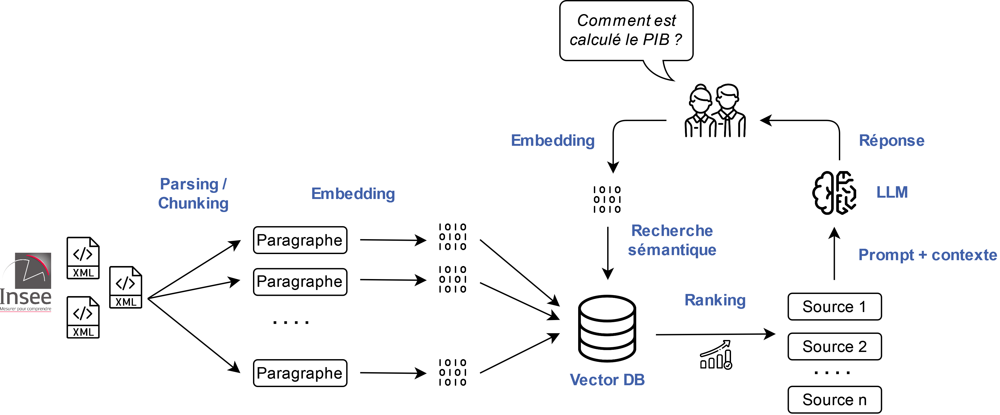

# Chatbot spécialisé sur le site [insee.fr](https://insee.fr)

Ce dépôt rassemble tous les codes permettant de construire un statbot entraîné à partir du site [insee.fr](https://insee.fr) à répondre à des questions sur ce site.

L'approche repose sur le principe du **RAG** : les pages les plus pertinentes du site [insee.fr](https://insee.fr) servent de contexte à un LLM pour générer une réponse plus satisfaisante. Ce projet est antérieur, de quelques mois, à la *hype* des agents qui pourraient fournir une approche complémentaire au RAG. 

> [!TIP] Ressources complémentaires
> Pour en savoir plus sur le projet, se référer à cette présentation au [*Workshop IA de l'UNECE* (2024)](https://linogaliana.github.io/slides-workshopgenAI-unece2025/) ou à la conférence [*World Statistical Congress* (2025)](https://www.linkedin.com/posts/linogaliana_slides-isi-wsc-conference-activity-7381687643308240896-TAhV/).

> [!CAUTION] Attention
> Ce projet est une preuve de concept mais n'a pas vocation à fournir une information statistique fiable. Il peut fournir des informations datées, imprécises ou incorrectes: comme pour toute réponse automatique par IA, méfiez-vous de la réponse !

## Architecture méthodologique du projet

Comme tout projet RAG, celui-ci est principalement constitué de deux parties:

* Création d'une base de connaissance LLM-*ready* construite à partir de l'ensemble des pages du site [insee.fr](https://insee.fr). Celle-ci est stockée et à mise à disposition dans une base de données vectorielle (technique du *retrieval*).
* Application *front-end* de *chat* où un utilisateur peut poser une question qui va déclencher une recherche de source.

Le principe général de la structuration d'un projet RAG est le suivant:



Pour l'**évaluation**, nous confrontons le RAG à des questions/réponses constituées par des experts. Nous évaluons le projet à l'aune de plusieurs métriques d'intérêt définies avec des experts métiers (taux d'hallucination, capacité à citer la source attendue, taux de satisfaction, etc.)

> [!TIP] Ressources complémentaires
> Pour en savoir plus sur l'évaluation de ce projet, voir cette présentation au [*World Statistical Congress* (2025)](https://www.linkedin.com/posts/linogaliana_slides-isi-wsc-conference-activity-7381687643308240896-TAhV/) et les ressources de qualité proposées par [Hamel Husain](https://hamel.dev/).


## Architecture technique du projet

Un projet RAG est très exigeant du point de vue technique. Pour le rendre plus reproductible, nous avons tenté d'adopter les meilleures pratiques dans le domaine en décomposant chaque partie du projet en module s'appuyant sur la technologie la plus adéquate. 

Nous avons utilisé le [SSPCloud](https://datalab.sspcloud.fr/) pour ce projet qui nous offrait les briques techniques à l'état de l'art pour ce projet. Parmi celles-ci:

* Un peu de `Langchain` (réduit à la portion congrue pour avoir un meilleur contrôle des opérations) et du `Streamlit` par l'intermédiaire de `Python` 
* Système de stockage `S3` pour le stockage des données (fichiers XML bruts, fichiers parsés, *logs*). Pour l'orchestration par *Kube* cela implique un compte de service ;
* `MLFlow` pour l'archivage des métriques d'évaluation afin de suivre la qualité des variantes développées avant un passage en production ;
* Deux LLM (un spécialisé dans l'*embedding*, l'autre dans la génération) disponibles par le biais d'une API au standard `OpenAI`. En l'occurrence, nous avons utilisé des LLM *self-hosted* par le biais de `VLLM`. 
* `Langfuse` (adoption récente) pour enregistrer les traces des appels aux LLM et versionner les *prompts*
* `Qdrant` pour la base de données vectorielle. Le code fonctionne également avec `ChromaDB` même si nous avons privilégié `Qdrant`.
* `Vault` pour la gestion des secrets et variables d'environnement. Il est possible d'utiliser `dotenv` en complément ou substitut. Voir plus bas pour les variables d'environnement nécessaires.

> [!NOTE]
> Cet ensemble de briques techniques peut donner le vertige mais rend le projet plus portable par rapport au monolithe initial. 
> 
> La plupart de ces couches techniques ne sont pas indispensables à un projet RAG à l'exception de la base de données vectorielle et des deux LLM. Il sera néanmoins compliqué de développer puis faire vivre le projet sans adopter une approche modulaire. 


## Reproduire l'application

L'application de démonstration (le _front_) s'appuie sur `streamlit`. Pour répliquer en local,

```python
uv run streamlit run app.py --server.port 5000 --server.address 0.0.0.0
```

> [!WARNING]
> Malgré sa modularité, l'architecture du projet est complexe et nécessite certains composants en _back office_ pour être répliquable. 
> 
> Plus d'éléments dans la partie **"Architecture"**


## Reproduire la création du contenu

C'est l'étape qui demande le plus de ressources: un LLM disponible en continu, exposé par le biais d'une API OpenAI pendant quelques heures pour faire de l'*embedding* à destination d'une base de données vectorielle (Qdrant ou Chroma). 

Pour tester le code

```python
uv run run_build_database.py --max_pages 10
```

Pour l'industrialiser


```python
kubectl delete job build-database
kubectl apply -f deployment/build/job.yaml
kubectl logs -f job/build-database
```

## Variables d'environnement nécessaire pour reproduire le projet

La reproduction du projet repose sur un ensemble de variables d’environnement qui permettent de configurer les accès aux services externes, pointer vers les bonnes ressources et séparer la configuration du code.

Cette approche évite de *hardcoder* des secrets ou des URLs dans le dépôt, et permet d’exécuter le projet dans plusieurs contextes, par exemple en local, dans Docker, ou sur Kubernetes.

Seules les deux premières familles de variables d'environnement sont indispensables (LLM, bases de données vectorielles). Les autres ne sont pas, en soi, indispensables mais sont pratiques pour construire un projet moins monolithique.

**1. Variables liées aux API de modèles**

| Variable                          | Description |
|----------------------------------|-------------|
| `URL_EMBEDDING_MODEL`            | Endpoint du modèle d’embedding. |
| `URL_GENERATIVE_MODEL`           | Endpoint du modèle génératif. |
| `OPENAI_API_KEY`                 | Clé d'API (si nécessaire). |


> [!WARNING]
> Le projet suppose que les deux modèles (*embedding* et génératif) sont exposés séparemment. S'ils sont disponibles derrière un même *endpoint* il faudra légèrement changer le code

**2. Variables liées aux bases de données vectorielles**

Quelle que soit la solution technique choisie (Qdrant ou Chroma), il faut définir la collection de la base de données vectorielle utilisée

| Variable                          | Description |
|----------------------------------|-------------|
| `COLLECTION_NAME`                | Nom de la collection utilisée. |

Pour un projet s'appuyant sur Qdrant:

| Variable                          | Description |
|----------------------------------|-------------|
| `QDRANT_API_KEY`                 | Clé API pour Qdrant. |
| `QDRANT_URL`                     | URL du service Qdrant. |

Pour un projet préférant Chroma:

| Variable                          | Description |
|----------------------------------|-------------|
| `CHROMA_CLIENT_AUTH_CREDENTIALS` | Informations d’authentification pour le client Chroma. |
| `CHROMA_CLIENT_AUTH_PROVIDER`    | Provider d’authentification utilisé par Chroma. |
| `CHROMA_SERVER_HOST`             | Hôte du serveur Chroma. |
| `CHROMA_SERVER_HTTP_PORT`        | Port HTTP du serveur Chroma. |
| `CHROMA_URL`                     | URL complète du service Chroma. |

**4. Variables liées au _logging_**

| Variable                          | Description |
|----------------------------------|-------------|
| `LANGFUSE_BASE_URL`              | URL de base de l’instance Langfuse. |
| `LANGFUSE_HOST`                  | Hôte du service Langfuse. |
| `LANGFUSE_PUBLIC_KEY`            | Clé publique Langfuse. |
| `LANGFUSE_SECRET_KEY`            | Clé secrète Langfuse. |
| `MLFLOW_TRACKING_URI`            | URI du serveur MLflow. |
| `MLFLOW_TRACKING_USERNAME`       | Nom d’utilisateur MLflow. |
| `MLFLOW_TRACKING_PASSWORD`       | Mot de passe MLflow. |


**5. Variables liées à `S3`**

| Variable                          | Description |
|----------------------------------|-------------|
| `ANNOTATIONS_LOCATION`           | Emplacement du fichier d'annotations utilisées pour évaluer le projet (fichier, dossier ou bucket). |
| `AWS_ACCESS_KEY_ID`          | Identifiant pour accéder aux ressources sur S3. |
| `AWS_SECRET_ACCESS_KEY_OLD`      | Clé secrète AWS associée. |
| `AWS_SESSION_TOKEN_OLD`          | Token de session AWS (pour des credentials temporaires). |
| `PATH_LOG_APP`                   | Chemin de stockage des logs applicatifs. |

